# Administrador de Tareas del Hogar

Una API REST diseñada para la gestión de tareas del hogar. 

## Nombre del Proyecto
Administrador de Tareas del Hogar

## Descripción del Proyecto
La API gestionará las tareas del hogar mediante documentos representados en la base de datos.

### Documentos y Campos

#### 1. Usuario
Representa a los usuarios registrados en la plataforma.
- **id** (string?, único): Identificador único del usuario.
- **nombre** (string): Nombre del usuario.
- **email** (string, único): Correo electrónico del usuario.
- **contraseña** (string): Contraseña cifrada del usuario.
- **rol** (string?): Rol del usuario ("USER" o "ADMIN") por defecto "USER".

#### 2. Tarea
Representa una tarea asignada dentro del sistema.
- **id** (string?, único): Identificador único de la tarea.
- **titulo** (string): Título breve de la tarea.
- **descripcion** (string): Descripción detallada de la tarea.
- **estado** (string?): Estado de la tarea ("pendiente", "completada") por defecto "pendiente".
- **fechaCreacion** (date?): Fecha en la que se creó la tarea, por defecto la fecha actual.
- **idUsuario** (string): ID del usuario al que se le asignó la tarea.

## Endpoints

### Usuario /usuarios

1. **POST /usuarios/registro**
   - **Descripción:** Registra un nuevo usuario en la plataforma.
   - **Campos requeridos:** `nombre`, `email`, `contraseña`.
   - **Respuesta:** Código 201 si el registro es exitoso.

2. **POST /usuarios/login**
   - **Descripción:** Permite a un usuario iniciar sesión.
   - **Campos requeridos:** `email`, `contraseña`.
   - **Respuesta:** Código 200 con un token de autenticación.

### Tarea /tareas

1. **GET**
   - **Descripción:** Obtiene todas las tareas (solo accesible para ADMIN).
   - **Respuesta:** Código 200 con la lista de tareas.

2. **GET /tareas/mis-tareas**
   - **Descripción:** Obtiene las tareas asignadas al usuario que realiza la solicitud.
   - **Respuesta:** Código 200 con la lista de tareas del usuario.
      
3. **GET /tareas/id**
   - **Descripción:** Obtiene las tareas asignadas al usuario con el este id(solo un ADMIN puede verlas a otro usuario).
   - **Respuesta:** Código 200 con la lista de tareas del usuario.

4. **POST**
   - **Descripción:** Crea una nueva tarea.
   - **Campos requeridos:** `titulo`, `descripcion`, `asignadoA` (solo ADMIN puede asignar a otros).
   - **Respuesta:** Código 201 si la creación es exitosa.

5. **PUT /tareas/:id**
   - **Descripción:** Marca una tarea como completada.
   - **Respuesta:** Código 200 si se actualizó exitosamente.

6. **DELETE /tareas/:id**
   - **Descripción:** Elimina una tarea. Los usuarios solo pueden eliminar sus propias tareas, mientras que los ADMIN pueden eliminar cualquier tarea.
   - **Respuesta:** Código 200 si se elimina correctamente.

## Lógica de Negocio

1. Los usuarios con rol `USER` solo pueden ver, crear, modificar y eliminar sus propias tareas.
2. Los usuarios con rol `ADMIN` pueden ver, crear, modificar y eliminar tareas de cualquier usuario.
3. El estado de una tarea puede ser "pendiente" o "completada".
4. Solo los ADMIN pueden asignar tareas a otros usuarios.

## Restricciones de Seguridad

1. **Autenticación:** Solo los usuarios autenticados pueden acceder a los recursos.
2. **Autorización:** Verificación de roles para restringir el acceso a ciertos endpoints (por ejemplo, ADMIN para ver todas las tareas).
3. **Cifrado de Contraseñas:** Las contraseñas se almacenan de forma cifrada utilizando algoritmos seguros como bcrypt.
4. **Validación de Datos:** Validación exhaustiva de los datos recibidos en las solicitudes para evitar inyecciones y datos malformados.

## Excepciones y Códigos de Estado

1. **400 Bad Request:** Se genera cuando faltan campos requeridos o los datos son inválidos.
2. **401 Unauthorized:** Se genera cuando un usuario no autenticado intenta acceder a recursos protegidos.
3. **403 Forbidden:** Se genera cuando un usuario intenta acceder o modificar recursos que no le pertenecen.
4. **404 Not Found:** Se genera cuando no se encuentra un recurso solicitado (por ejemplo, una tarea).
5. **500 Internal Server Error:** Se genera cuando ocurre un error inesperado en el servidor.

## PRUEBAS GESTIÓN USUARIOS
Aquí puedes ver una demostración del proyecto:

Primero ingresamos los valores correctos para el login

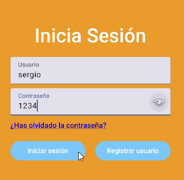

Como respuesta exitosa nos da el token

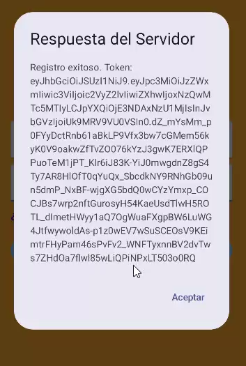

Ahora ingresamos la contraseña mal

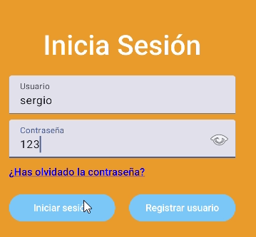

Como los valores no son correctos nos da una excepcion de mensaje

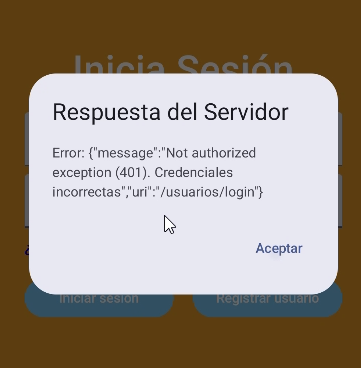

Ahora ingresamos el usuario mal

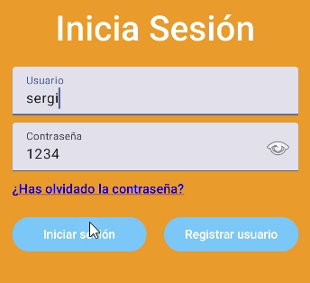

Como los valores no son correctos nos da una excepcion de mensaje

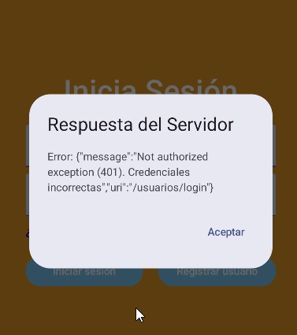

Ingresamos un nuevo usuario para registrarlo

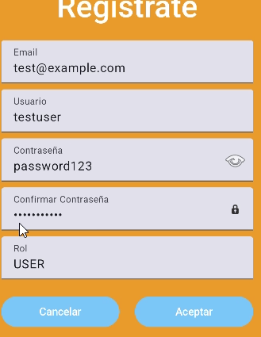

Nos da el mensaje que se a registrado con éxito

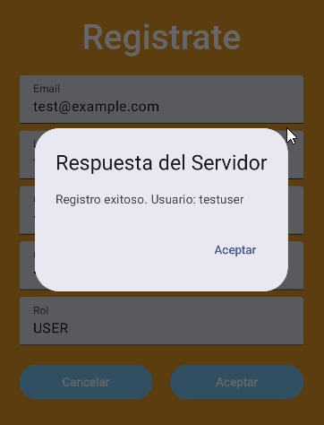

Si lo intentamos volver a registrar nos da este error

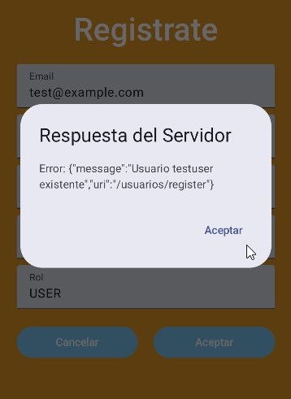

Ahora le cambiamos la contraseña para que no coincidan y también le cambiamos el nombre para que no del mensaje de antes

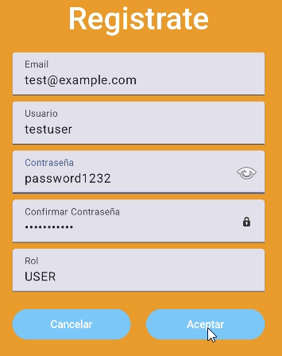

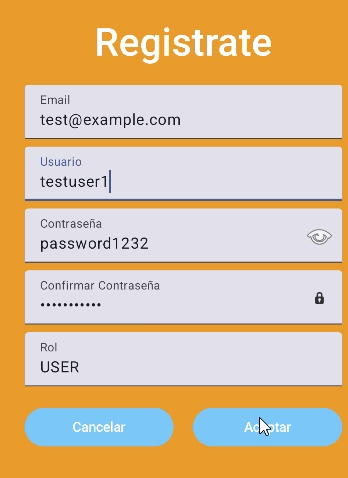

Y nos da este error 

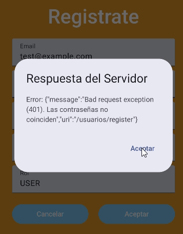
